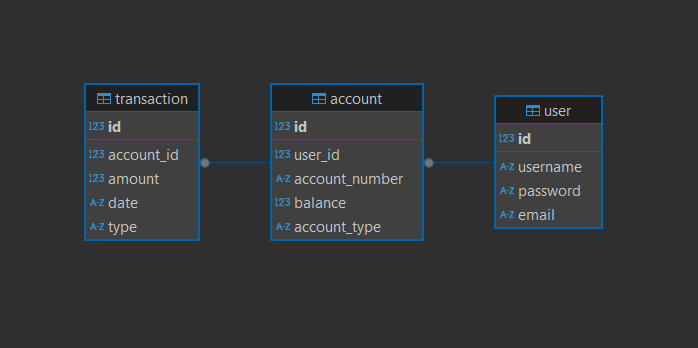

# MaBank API Documentation

## Overview

This is a RESTful API for **MaBank**, which provides functionalities for **User Management**, **Account Management**, and **Transaction Management**. The API is designed to handle secure and efficient interactions between users and the system.

## Features

- **User Management**: Allows users to create, update, and view their profile.
- **Account Management**: Supports creating, retrieving, updating, and deleting accounts.
- **Transaction Management**: Facilitates transaction operations like deposits, withdrawals, and transfers.

## Installation & Setup

### Prerequisites

- Python 3.x
- Flask
- SQLAlchemy
- Postman (for API testing)

### Installation Steps

1. Clone the repository:

   ```bash
   git clone https://github.com/your-username/revobank-api.git
   ```

2. Navigate to the project directory:

   ```bash
   cd revobank-api
   ```

3. Install required dependencies:

   ```bash
   pip install -r requirements.txt
   ```

4. Set up the database by running the necessary migrations:

   ```bash
   flask db upgrade
   ```

5. Run the application:
   ```bash
   python app.py
   ```

## API Usage

You can test the API using Postman. Below is the link to the API collection:

[MaBank API Postman Collection](https://manggala-software-house.postman.co/workspace/Manggala-Software-House-Workspa~0b9c20a0-042e-47c4-bc79-d4522129b176/collection/40816177-d1bb6a5a-3f72-488c-875f-f2677e8898d1?action=share&creator=40816177)

## Database Screenshot

Here is a screenshot of the current database schema for the MaBank application:



## Endpoints

### User Management:

- **POST** `/users`: Create a new user account.
- **GET** `/users/:id`: Retrieve the profile of the currently logged-in user.
- **PUT** `/users/:id`: Update the profile of the logged-in user.

### Account Management:

- **GET** `/accounts`: Retrieve a list of all accounts.
- **GET** `/accounts/:id`: Retrieve an account by ID.
- **POST** `/accounts`: Create a new account.
- **PUT** `/accounts/:id`: Update an existing account.
- **DELETE** `/accounts/:id`: Delete an account.

### Transaction Management:

- **GET** `/transactions`: Retrieve a list of all transactions.
- **GET** `/transactions/:id`: Retrieve a specific transaction by ID.
- **POST** `/transactions`: Initiate a new transaction (deposit, withdrawal, or transfer).

## Error Handling

The API returns appropriate HTTP status codes for each request:

- **200 OK** for successful requests.
- **201 Created** for successfully created resources.
- **400 Bad Request** for invalid input.
- **404 Not Found** for missing resources.
- **500 Internal Server Error** for server-related issues.

---
